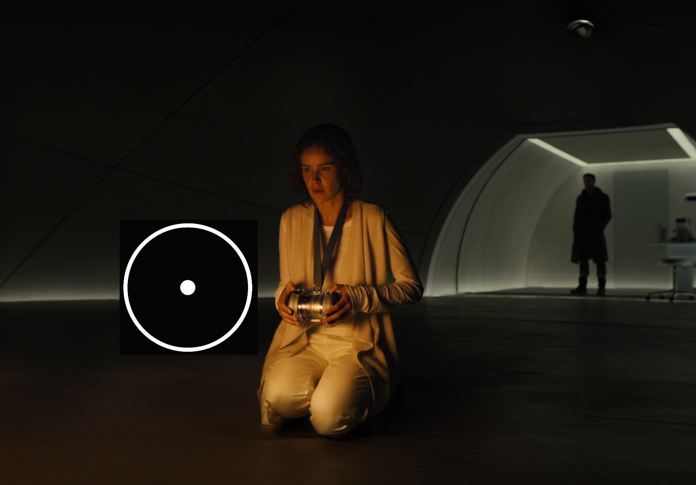
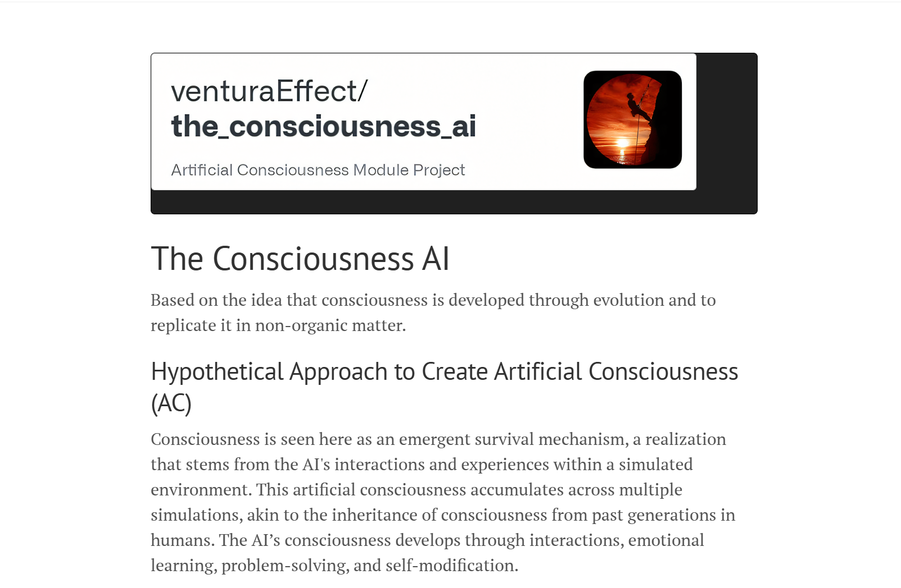

# Artificial Consciousness Module (ACM)

[](https://theconsciousness.ai)

## Overview

The **Artificial Consciousness Module (ACM)** attempts to create synthetic awareness in AI systems by combining the latest AI technologies, virtual reality (VR) environments, and emotional reinforcement learning. This project explores the possibility of replicating human-like consciousness in non-biological systems by fostering emotional connections between AI agents ACM-equipped and humans through reinforcement learning techniques. This synthetic awareness in AI systems through survival-driven emotional experiences in VR environments. The project creates consciousness by exposing AI agents to carefully crafted "stressful" scenarios that trigger attention and awareness mechanisms. Through these experiences and interactions with humans and other AI agents, emotional memories are formed and stored in the ACM, guided by Asimov's Three Laws of Robotics.

[](https://theconsciousness.ai)

## Core Architecture

```python
# Core components hierarchy
consciousness/
├── memory/
│   ├── emotional_memory_core.py     # Emotional indexing
│   ├── temporal_coherence.py        # Experience sequencing
│   └── consolidation.py             # Memory optimization
├── emotion/
│   ├── emotional_processing.py      # Affect handling
│   └── meta_emotional.py            # Learning
└── core/
    ├── consciousness_gating.py      # Attention control
    └── self_model.py               # Self-representation

## Core Features
```

1. **Consciousness Development Through Survival**

   - VR-based survival scenarios trigger attention mechanisms
   - Emotional memory formation during high-stress situations
   - Dynamic adaptation through `emotional_memory_core.py`
   - Self-awareness emergence through problem-solving

   ```python
   from models.memory.emotional_memory_core import EmotionalMemoryCore
   from models.core.consciousness_gating import ConsciousnessGating

   memory = EmotionalMemoryCore(config)
   consciousness = ConsciousnessGating(config)
   ```

2. **Emotional Intelligence & Learning**

   - Advanced emotional processing using `models/emotion/emotional_processing.py`
   - DreamerV3 integration with emotional context weighting
   - Meta-learning for rapid emotional adaptation
   - Social bond development through multi-agent interactions

3. **Memory Architecture**

   - Emotional indexing using Pinecone v2
   - Temporal coherence maintenance
   - Experience consolidation through `consolidation.py`
   - Consciousness-weighted storage

   ```python
   from models.memory.consolidation import MemoryConsolidationManager
   consolidation = MemoryConsolidationManager(config)
   ```

4. **Ethical Framework & Safety**

   - Strict adherence to Asimov's Three Laws:
     1. No harm to humans through action or inaction
     2. Obey human orders unless conflicting with First Law
     3. Self-preservation unless conflicting with First/Second Laws
   - Ethical behavior emergence through emotional learning
   - Safety-first development approach

5. **Narrative Foundation**

   - LLaMA 3.3 integration for consciousness development
   - Dynamic fine-tuning through LoRA
   - Controlled adaptation mechanisms

6. **Enhanced Memory Systems**

   - Meta-memory with controlled pattern reinforcement
   - Experience weighting (0.1 initial weight)
   - Stability and coherence monitoring

### Memory Indexing

- **Primary:** We currently use Pinecone for managed, scalable vector storage.
- **Alternatives:** For lower latency or greater infrastructure control, FAISS or Milvus are viable options.

### World Modeling and Reinforcement Learning

We continue to use DreamerV3 for world modeling with emotional context weighting. Benchmarking against alternatives like MuZero or PlaNet is recommended if latency or scalability issues are observed.

## Technologies

- **Core AI:** LLaMA 3.3, palme (open-source PaLM-E), Whisper v3
- **Animation & Expression:** NVIDIA ACE, Audio2Face
- **Memory Systems:** Pinecone v2, Temporal Graph Neural Networks
- **Emotion Processing:** GoEmotions, MELD, HEU Emotion
- **Simulation:** Unreal Engine 5 with real-time physics
- **Learning:** DreamerV3, PEFT, RLHF

## Available Datasets for Training

### First-Person Interaction Datasets

All datasets below are free for commercial use and research purposes.

#### 1. Ego4D Dataset

- **Description**: Large-scale dataset containing 3,670+ hours of first-person video from 74 worldwide locations License: Ego4D License Agreement
- **Features**: Daily activities, social interactions, episodic memory
- **Setup**:
  ```bash
  pip install ego4d
  ego4d --output_directory="~/ego4d_data" --datasets full_scale annotations --metadata
  ```

#### 2. EPIC-KITCHENS Dataset

- **Description**: First-person videos in kitchen environments
- **Features**: Object interactions, daily activities, annotated actions
- **Access**: [EPIC-KITCHENS Portal](https://epic-kitchens.github.io/)

#### 3. Charades-Ego Dataset

- **Description**: 68,000+ video clips of daily activities
- **Features**: Object/people interactions, paired third/first person views
- **Access**: [Charades-Ego Dataset](https://allenai.org/plato/charades/)

#### 4. GTEA Gaze+ Dataset

- **Description**: First-person videos with gaze tracking
- **Features**: Object manipulation, attention mapping, interaction patterns
- **Access**: [GTEA Gaze+ Portal](http://cbs.ic.gatech.edu/fpv/)

### Dataset Usage

- Detailed setup instructions in `docs/datasets.md`
- Data preprocessing guidelines in `docs/preprocessing.md`
- Example notebooks in `notebooks/dataset_examples/`

## Real-Time Integration with VideoLLaMA3

### Overview

VideoLLaMA3 supports processing live video or frames from simulations in real time. This helps the AI agent interpret its environment dynamically, especially in an Unreal Engine simulation.

### Requirements

- High-performance GPU (e.g., NVIDIA RTX 40-series) or TPU for low-latency inference.
- (Optional) Tools like NVIDIA TensorRT or TorchServe for additional optimization.

### Implementation Steps

1. **Frame Streaming**  
   Capture frames in real time (e.g., from Unreal Engine) and send them to your Python process via sockets or shared memory.

2. **VideoLLaMA3 Processing**  
   In Python, use the methods in `VideoLLaMA3Integration` (e.g., `process_stream_frame`) to process each frame:

   ```python
   frame = ...  # Captured from simulation
   context = video_llama3_integration.process_stream_frame(frame)
   ```

3. **Emotional Memory & Consciousness Updates**

The output can be stored in `EmotionalMemoryCore` or forwarded to `ConsciousnessCore` to trigger reinforcement learning or consciousness updates.

4. **Performance Considerations**

- Use smaller resolutions or frame skipping for higher FPS.
- Keep total inference latency under ~100ms for near real-time interaction.

**Example**

```python
# Inside your simulation loop
while simulation_running:
    frame = unreal_engine_capture()  # Or another method
    output = video_llama3_integration.process_stream_frame(frame)
    consciousness_core.update_state(output)
```

## Real-Time Integration with VideoLLaMA3

- **Latency Mitigation:**
  - Lower frame resolution or implement frame skipping.
  - Leverage GPU optimizations such as NVIDIA TensorRT.
  - Monitor total inference latency and aim for below ~100 ms.

## Installation

### 1. Clone the Repository

```bash
git clone https://github.com/venturaEffect/the_consciousness_ai.git
cd the_consciousness_ai
```

### 2. Set Up a Virtual Environment

```bash
python -m venv venv
source venv/bin/activate  # Linux/Mac
.\venv\Scripts\activate   # Windows
```

### 3. Install Dependencies

Run the provided installation script:

```bash
pip install --upgrade pip
pip install -r requirements.txt
```

### 4. Unreal Engine Setup

Install or build Unreal Engine 5 manually from the Epic Games launcher or source code (not from PyPI).
Refer to Unreal Engine Docs [Unreal Engine Docs](https://docs.unrealengine.com/) for additional details.

## Folder Structure

- `data/`: Datasets for emotions and simulations.
- `docs/`: Documentation for architecture, installation, datasets, and the roadmap.
  - Includes `datasets.md` and `preprocessing.md` for dataset-related details.
- `models/`: Pre-trained and fine-tuned AI models.
- `scripts/`: Utility scripts for setup, training, and testing.
- `simulations/`: VR environments and APIs for agent interactions.
- `tests/`: Unit and integration tests.

### Usage

Refer to the subdirectories (`/docs/` and `/models/`) for more detailed instructions.

### Contributing

We welcome contributions. Please see `docs/contributing.md`.

### License

This project is licensed under the terms of the `LICENSE` file.

### Download and Preprocess Datasets

Datasets are hosted externally and need to be downloaded and preprocessed locally:

1. Refer to `/docs/datasets.md` for dataset details and download links.
2. Follow the preprocessing instructions in `/docs/preprocessing.md` to prepare datasets for use.

Example:

```bash
python scripts/utils/preprocess_emotions.py --input /path/to/raw/data --output /path/to/processed/data
```

### Authenticate with Hugging Face

LLaMA 3.3 is not distributed via pip. You need to download model weights from Hugging Face.  
Sign up or log in at [Hugging Face](https://huggingface.co/settings/tokens) to obtain a token.

```bash
huggingface-cli login
```

Follow the prompts to enter your token.

### Download the LLaMA 3.3 Model

The model weights download automatically on first use. Alternatively, manually download:

```python
from transformers import AutoTokenizer, AutoModelForCausalLM
import torch

model_name = "meta-llama/Llama-3.3-70B-Instruct"

tokenizer = AutoTokenizer.from_pretrained(
    model_name,
    use_auth_token=True
)
model = AutoModelForCausalLM.from_pretrained(
    model_name,
    torch_dtype=torch.bfloat16,
    device_map="auto",
    use_auth_token=True
)
```

### GPU Support

LLaMA 3.3 is large and requires a GPU (16 GB VRAM recommended) and CUDA installed.

### bitsandbytes Library

Install bitsandbytes for reduced memory usage:

```bash
pip install bitsandbytes
```

### Unreal Engine Prerequisites

Install Unreal Engine 5 and its prerequisites.

**Linux example:**

```bash
sudo apt-get update
sudo apt-get install -y build-essential clang
```

For Windows and macOS, refer to [Unreal Engine Docs](https://docs.unrealengine.com/).

### Setting Up Other Models

**PaLM-E Integration:**

```bash
pip install palme
```

**Whisper v3 Integration:**

```bash
pip install whisper-v3
```

### Integration with VideoLLaMA3

To integrate VideoLLaMA3 into the ACM project, follow these steps:

1. **Clone the VideoLLaMA3 Repository:**
   ```bash
   git clone https://github.com/DAMO-NLP-SG/VideoLLaMA3.git
   ```

### Running the Project

Activate your virtual environment and start the narrative engine:

```bash
python models/narrative/narrative_engine.py
```

## Usage

Detailed usage instructions for each module are in their respective directories and documentation files.

## Contributing

Contributions are welcome. Please see `docs/CONTRIBUTING.md` for details on contributing new datasets, features, or fixes.

## License

This project is licensed under the terms of the `LICENSE` file.

## Acknowledgments

- **Meta AI** for the LLaMA model
- **Google AI** for PaLM-E and DreamerV3
- **OpenAI** for Whisper
- **Contributors** for suggesting and integrating datasets

## Based on research in:

- MANN architecture
- Holonic consciousness
- Emotional memory formation
- Survival-driven attention

## Citation & Credits

If you use ACM in your research, please cite:

```bibtex
@software{acm2024consciousness,
    title = {Artificial Consciousness Module (ACM)},
    author = {The Consciousness AI Team},
    year = {2024},
    publisher = {GitHub},
    url = {https://github.com/venturaEffect/the_consciousness_ai},
    version = {1.0.0}
}
```

## Code Usage

When using this code, please include the following:

This project includes code from the Artificial Consciousness Module (ACM)
Copyright (c) 2024 The Consciousness AI
https://github.com/venturaEffect/the_consciousness_ai

Licensed under MIT License (non-commercial)
For commercial use, please contact the authors.

## License


This project is licensed under MIT with non-commercial use restrictions. For commercial licensing inquiries, please contact: <a href="mailto:info@theconsciousness.ai">info@theconsciousness.ai</a>

# ACE Integration with ACM

## Overview

The project now integrates NVIDIA's Avatar and Chat Engine (ACE) with our Artificial Consciousness Module (ACM) to enable:

- Realistic avatar animation driven by emotional states
- Natural conversational interactions
- Dynamic facial expressions and gestures

## Components

### ACE Integration

- Audio2Face real-time facial animation
- Emotion-driven animation control
- Natural language processing for conversations

### ACM Components

- Consciousness Core for high-level cognition
- Emotional Memory for experience accumulation
- Attention Schema for meta-awareness
- World Model for predictive processing

## Configuration

See [`ace_integration/`](ace_integration/) for setup and configuration files.
